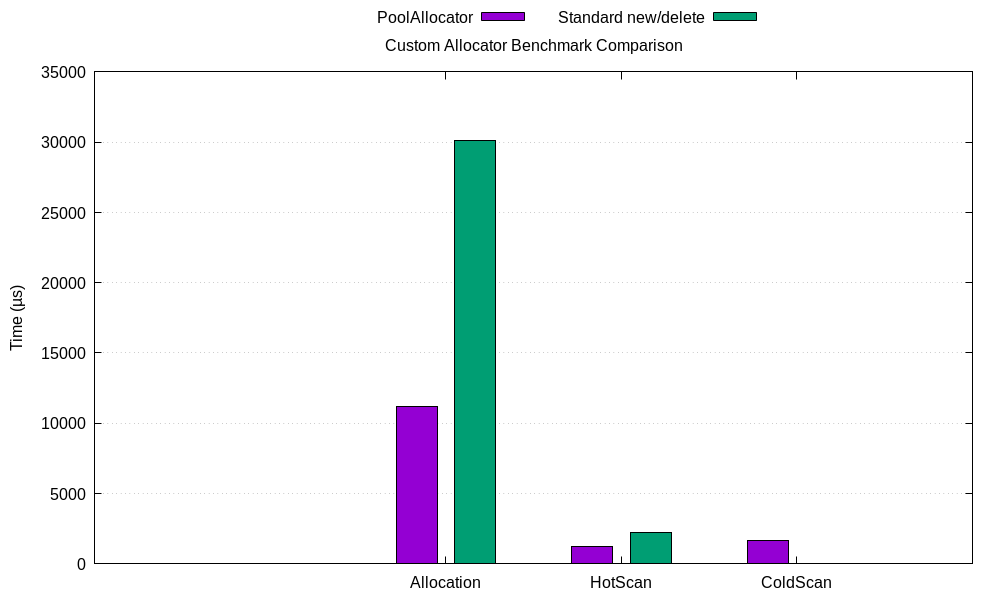

# High-Performance Data-Split Pool Allocator

A cache-optimized, zero-allocation-at-runtime pool allocator using **Structure of Arrays (SoA)** and **Hot/Cold Data Splitting** — engineered for ultra-low latency execution environments such as HFT order books and matching engines, where L1 cache hit rate directly determines tick-to-trade latency.

---

## Architecture

Standard memory management treats order objects as cohesive blobs (**Array of Structures — AoS**). In a matching engine's inner scan loop, this causes severe cache pollution: touching `price` drags in `order_id`, `timestamp`, and every other field on the same cache line, even though the matching sweep never reads them.

This allocator eliminates that waste with two mechanical optimizations:

### 1. Hot/Cold Static Structure Splitting

Orders are decomposed into two separate structs based on access frequency:

- **`OrderHot` (16 bytes):** `price`, `remaining_qty`, `side` — the minimum dataset to evaluate an execution. This is what the matching sweep touches on every iteration.
- **`OrderCold` (32 bytes):** `order_id`, `timestamp`, `quantity`, `type`, `status` — metadata accessed only on fill confirmation or audit logging.

### 2. Cache-Line Harmonized SoA Layout

Instead of heap-allocating interleaved `[Hot|Cold][Hot|Cold]...` objects, two separate 64-byte-aligned contiguous arrays are pre-allocated:

```
AoS (standard):  [Hot|Cold] [Hot|Cold] [Hot|Cold] [Hot|Cold]
                  ^^^^^^^^^^^^ cache line contamination ^^^^^^^^^^^^

SoA (this pool): Hot:  [H0][H1][H2][H3][H4][H5][H6][H7] ...  ← 4 hot records per cache line
                 Cold: [C0][C1][C2][C3][C4][C5][C6][C7] ...  ← accessed separately
```

`OrderHot` is exactly 16 bytes. Each 64-byte L1 cache line fetch pulls **4 complete hot records** simultaneously. During a matching sweep over 1M orders, only the hot array is touched — 100% of every cache line fetched contains useful data.

---

## Benchmark Results

All timings: 7-run median, `std::chrono::steady_clock`, `-O3 -march=native`, 1 warmup run before timing.

> **Note on the benchmark methodology:** The heap allocation time includes the paired `delete` pass — this reflects real-world cost where allocation and deallocation are both paid in production. The cold scan comparison is deliberately honest: pool cold scan accesses out-of-band memory (an extra indirection step), so it is expected to be slightly slower than a contiguous heap scan. The hot scan is where the allocator wins decisively.

### Benchmark Comparison (1,000,000 orders)



| Metric | Pool Allocator | Standard new/delete | Speedup |
|:---|---:|---:|:---:|
| **Allocation throughput** | ~11,200 µs | ~27,856 µs | **~2.49x faster** |
| **Hot-only scan** (`price` field) | ~1,301 µs | ~2,254 µs | **~1.73x faster** |
| **Cold scan** (`order_id` lookup) | ~2,338 µs | ~2,069 µs | ~1.13x slower* |

*Pool cold scan is slower by design — cold data is out-of-band, requiring an additional index dereference. This is the correct trade-off: the matching hot path wins, and cold metadata is accessed only on fill events.

### Hot scan throughput

| Metric | Value |
|:---|:---|
| Hot orders per cache line | 4 |
| Hot scan time / order | ~1.30 ns/order |
| Hot working set (1M orders) | 15,625 KB (~15.25 MB) |
| Cold working set (1M orders) | 31,250 KB (~30.5 MB) |

### Hardware counter note

`perf stat` was attempted for cache-miss / cache-reference counters but Linux kernel policy blocked access (`/proc/sys/kernel/perf_event_paranoid = 4`). Timing results are from `steady_clock` only. To enable hardware counters: `sudo sysctl kernel.perf_event_paranoid=1`.

---

## The Prefetcher Paradox — Why Isolated Benchmarks Understate the Real Advantage

In a sequential isolated benchmark, iterating through a freshly allocated `Order*` pointer array can look competitive. This is a hardware prefetcher artefact, not a true performance result:

1. **Sequential trap:** The benchmark allocates pointers linearly and reads them monotonically. Modern CPU prefetch circuits detect this 1D pattern and pull pages into cache *before* the application requests them — making the heap look faster than it is in production.

2. **Production reality:** In a live matching engine, orders are created, modified, cancelled, and filled out of sequence across millions of slots. This creates heap fragmentation. When order IDs become non-sequential, the prefetcher fails and every `Order*` dereference risks a cold trip to main RAM (~100 ns penalty per miss).

3. **Why SoA wins under fragmentation:** Even with randomized access patterns, scanning `OrderHot` touches a fraction of the total memory footprint. Fewer cache lines fetched, fewer evictions, fewer stalls — regardless of access order.

---

## API

```cpp
#include "SplitPoolAllocator.h"

int main() {
    // Pre-allocates aligned memory at construction — zero heap calls during operation
    PoolAllocator pool(1'000'000);

    // Single allocation — zero heap allocation, placement-new into pool
    OrderHandler h = pool.allocate(
        OrderHot  { 15250u, 100u, 1u, {} },         // price: 152.50, qty: 100, side: BID
        OrderCold { 987654321u, 1000u, 100u, 1u, 0u, {} }
    );

    if (h.valid()) {
        OrderHot* hot = pool.getHot(h);
        std::cout << "Price: " << hot->price << '\n';
    }

    // Bulk allocation via std::span — AVX2 memcpy path
    std::vector<OrderHot>  hots(100);
    std::vector<OrderCold> colds(100);
    OrderHandler base = pool.allocate_range(hots, colds);

    pool.reset(); // O(1) — resets index, data stays in memory
    pool.clear(); // AVX2 zero — clean slate
}
```

---

## Build Requirements

```bash
# Requires AVX2 support (Intel Haswell / AMD Ryzen and later)
g++ -std=c++20 -O3 -march=native -mavx2 -o bench main.cpp

# Run benchmark — writes benchmark_data.dat automatically
./bench

# Regenerate graph from canonical data
gnuplot plot.gp
```

---

## Technical Specifications

| Property | Value |
|:---|:---|
| Language standard | C++20 |
| Alignment | 64-byte (hot array), 32-byte (cold array) |
| Zero init | AVX2 `_mm256_setzero_si256` |
| Bulk copy | AVX2 `_mm256_store_si256` / `_mm256_loadu_si256` |
| `OrderHot` size | 16 bytes (4 per cache line) |
| `OrderCold` size | 32 bytes (2 per cache line) |
| Heap calls at runtime | Zero |
| Thread safety | None — single-threaded by design (HFT hot path) |
